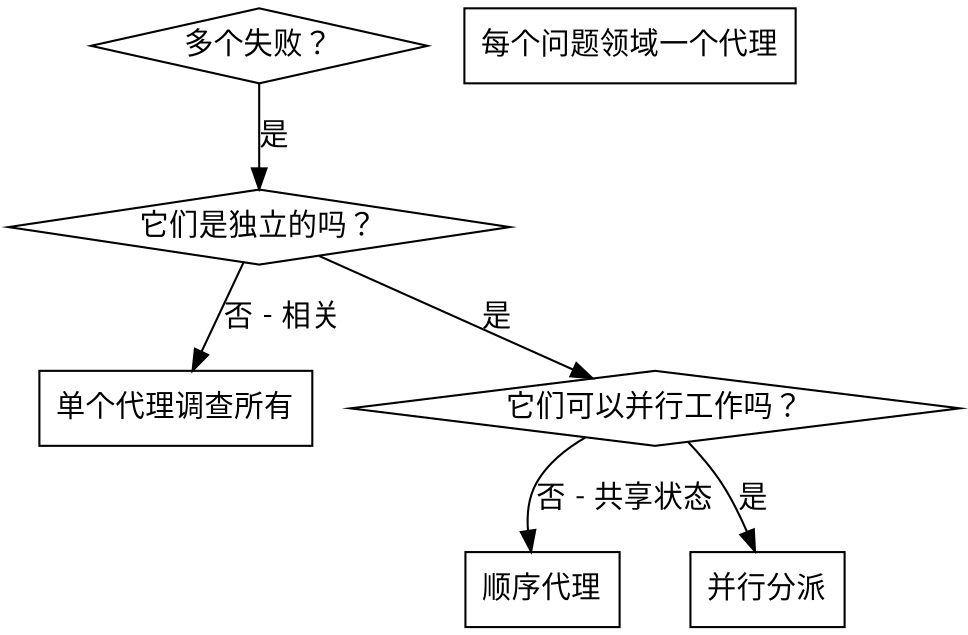

# 分派并行代理

## 概述

当你有多个不相关的失败（不同的测试文件、不同的子系统、不同的错误）时，顺序调查它们会浪费时间。每个调查都是独立的，可以并行进行。

**核心原则：**为每个独立问题领域分派一个代理。让它们并发工作。

## 何时使用



**在以下情况下使用：**
- 3 个以上具有不同根本原因的测试文件失败
- 多个子系统独立损坏
- 每个问题可以在没有其他上下文的情况下理解
- 调查之间没有共享状态

**在以下情况下不使用：**
- 失败是相关的（修复一个可能修复其他）
- 需要理解完整的系统状态
- 代理会相互干扰

## 模式

### 1. 识别独立领域

按损坏的内容对失败进行分组：
- 文件 A 测试：工具批准流程
- 文件 B 测试：批量完成行为
- 文件 C 测试：中止功能

每个领域都是独立的 - 修复工具批准不会影响中止测试。

### 2. 创建专注的代理任务

每个代理获得：
- **特定范围：**一个测试文件或子系统
- **明确目标：**使这些测试通过
- **约束：**不要更改其他代码
- **预期输出：**你发现和修复的内容摘要

### 3. 并行分派

```typescript
// 在 Claude Code / AI 环境中
Task("修复 agent-tool-abort.test.ts 失败")
Task("修复 batch-completion-behavior.test.ts 失败")
Task("修复 tool-approval-race-conditions.test.ts 失败")
// 所有三个并发运行
```

### 4. 审查和集成

当代理返回时：
- 阅读每个摘要
- 验证修复不冲突
- 运行完整测试套件
- 集成所有更改

## 代理 Prompt 结构

好的代理 prompt：
1. **专注** - 一个明确的问题领域
2. **自包含** - 理解问题所需的所有上下文
3. **输出具体** - 代理应该返回什么？

```markdown
修复 src/agents/agent-tool-abort.test.ts 中的 3 个失败测试：

1. "should abort tool with partial output capture" - 在消息中期望 'interrupted at'
2. "should handle mixed completed and aborted tools" - 快速工具被中止而不是完成
3. "should properly track pendingToolCount" - 期望 3 个结果但得到 0

这些是时序/竞态条件问题。你的任务：

1. 阅读测试文件并理解每个测试验证什么
2. 识别根本原因 - 时序问题还是实际错误？
3. 通过以下方式修复：
   - 用基于事件的等待替换任意超时
   - 如果发现，修复中止实现中的错误
   - 如果测试更改了行为，调整测试期望

不要只是增加超时 - 找到真正的问题。

返回：你发现和修复的内容摘要。
```

## 常见错误

**❌ 太宽泛：**"修复所有测试" - 代理迷失
**✅ 具体：**"修复 agent-tool-abort.test.ts" - 专注范围

**❌ 没有上下文：**"修复竞态条件" - 代理不知道在哪里
**✅ 上下文：**粘贴错误消息和测试名称

**❌ 没有约束：**代理可能重构所有内容
**✅ 约束：**"不要更改生产代码"或"只修复测试"

**❌ 模糊输出：**"修复它" - 你不知道改变了什么
**✅ 具体：**"返回根本原因和更改摘要"

## 何时不使用

**相关失败：**修复一个可能修复其他 - 首先一起调查
**需要完整上下文：**理解需要看到整个系统
**探索性调试：**你还不知道什么坏了
**共享状态：**代理会干扰（编辑相同文件，使用相同资源）

## 会话中的真实示例

**场景：**重大重构后 3 个文件中有 6 个测试失败

**失败：**
- agent-tool-abort.test.ts：3 个失败（时序问题）
- batch-completion-behavior.test.ts：2 个失败（工具未执行）
- tool-approval-race-conditions.test.ts：1 个失败（执行计数 = 0）

**决定：**独立领域 - 中止逻辑与批量完成分离，与竞态条件分离

**分派：**
```
代理 1 → 修复 agent-tool-abort.test.ts
代理 2 → 修复 batch-completion-behavior.test.ts
代理 3 → 修复 tool-approval-race-conditions.test.ts
```

**结果：**
- 代理 1：用基于事件的等待替换超时
- 代理 2：修复事件结构错误（threadId 在错误的位置）
- 代理 3：添加等待异步工具执行完成

**集成：**所有修复独立，无冲突，完整套件绿色

**节省时间：**3 个问题并行解决 vs 顺序解决

## 关键优势

1. **并行化** - 多个调查同时进行
2. **专注** - 每个代理范围狭窄，跟踪更少上下文
3. **独立性** - 代理不相互干扰
4. **速度** - 在 1 个的时间内解决 3 个问题

## 验证

代理返回后：
1. **审查每个摘要** - 理解改变了什么
2. **检查冲突** - 代理是否编辑了相同代码？
3. **运行完整套件** - 验证所有修复一起工作
4. **抽查** - 代理可能犯系统性错误

## 实际影响

来自调试会话（2025-10-03）：
- 3 个文件中有 6 个失败
- 3 个代理并行分派
- 所有调查同时完成
- 所有修复成功集成
- 代理更改之间零冲突
