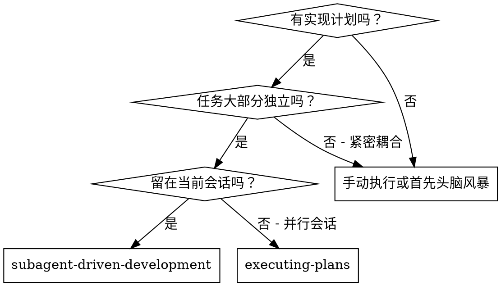
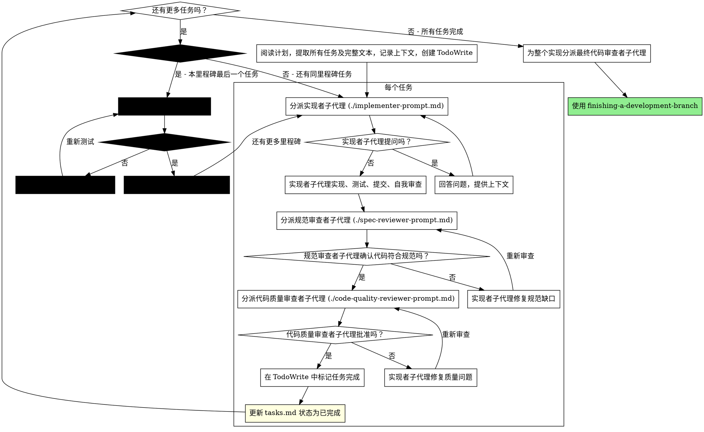

# 子代理驱动开发

通过为每个任务分派新的子代理来执行计划，每个任务后进行两阶段审查：首先进行规范合规性审查，然后进行代码质量审查。

**核心原则：**每个任务使用新的子代理 + 两阶段审查（规范然后质量）= 高质量、快速迭代

## 何时使用



**与执行计划（并行会话）相比：**
- 相同会话（无上下文切换）
- 每个任务使用新的子代理（无上下文污染）
- 每个任务后进行两阶段审查：首先规范合规性，然后代码质量
- 更快的迭代（任务之间无需人工介入）

## 流程



## Prompt 模板

- `./implementer-prompt.md` - 分派实现者子代理
- `./spec-reviewer-prompt.md` - 分派规范合规性审查者子代理
- `./code-quality-reviewer-prompt.md` - 分派代码质量审查者子代理

## 示例工作流

```
你：我正在使用子代理驱动开发执行此计划。

[一次性阅读计划文件：docs/plans/feature-plan.md]
[提取所有 5 个任务及完整文本和上下文]
[创建包含所有任务的 TodoWrite]

任务 1：Hook 安装脚本

[获取任务 1 文本和上下文（已提取）]
[用完整任务文本 + 上下文分派实现子代理]

实现者："在开始之前 - hook 应该安装在用户级还是系统级？"

你："用户级（~/.config/superpowers/hooks/）"

实现者："明白了。现在开始实现..."
[稍后] 实现者：
  - 实现了 install-hook 命令
  - 添加了测试，5/5 通过
  - 自我审查：发现我遗漏了 --force 标志，已添加
  - 已提交

[分派规范合规性审查者]
规范审查者：✅ 符合规范 - 满足所有要求，没有多余内容

[获取 git SHA，分派代码质量审查者]
代码审查者：优点：良好的测试覆盖率，干净。问题：无。批准。

[标记任务 1 完成]
[更新 tasks.md：任务 1 状态 待办→已完成]

任务 2：恢复模式

[获取任务 2 文本和上下文（已提取）]
[用完整任务文本 + 上下文分派实现子代理]

实现者：[没有问题，继续]
实现者：
  - 添加了验证/修复模式
  - 8/8 测试通过
  - 自我审查：全部良好
  - 已提交

[分派规范合规性审查者]
规范审查者：❌ 问题：
  - 缺少：进度报告（规范说"每 100 项报告一次"）
  - 多余：添加了 --json 标志（未请求）

[实现者修复问题]
实现者：删除了 --json 标志，添加了进度报告

[规范审查者再次审查]
规范审查者：✅ 现在符合规范

[分派代码质量审查者]
代码审查者：优点：稳固。问题（重要）：魔术数字（100）

[实现者修复]
实现者：提取了 PROGRESS_INTERVAL 常量

[代码审查者再次审查]
代码审查者：✅ 批准

[标记任务 2 完成]

...

[所有任务完成后]
[为整个实现分派最终代码审查者]
最终审查者：满足所有要求，准备合并

完成！
```

## 优势

**与手动执行相比：**
- 子代理自然遵循 TDD
- 每个任务有新的上下文（无混淆）
- 并行安全（子代理不干扰）
- 子代理可以提问（在工作之前和期间）

**与执行计划相比：**
- 相同会话（无交接）
- 持续进展（无等待）
- 自动审查检查点

**效率收益：**
- 无文件读取开销（控制器提供完整文本）
- 控制器精确策划所需的上下文
- 子代理预先获得完整信息
- 问题在工作开始前浮现（而非之后）

**质量门：**
- 自我审查在交接前捕获问题
- 两阶段审查：规范合规性，然后代码质量
- 审查循环确保修复真正有效
- 规范合规性防止过度/不足构建
- 代码质量确保实现构建良好

**成本：**
- 更多子代理调用（每个任务需要实现者 + 2 个审查者）
- 控制器做更多准备工作（预先提取所有任务）
- 审查循环增加迭代
- 但及早捕获问题（比以后调试更便宜）

## 红旗警告

**绝不：**
- 跳过审查（规范合规性或代码质量）
- 在有未修复问题的情况下继续
- 并行分派多个实现子代理（冲突）
- 让子代理阅读计划文件（改为提供完整文本）
- 跳过场景设置上下文（子代理需要理解任务的位置）
- 忽略子代理的问题（在让他们继续之前回答）
- 在规范合规性上接受"差不多"（规范审查者发现问题 = 未完成）
- 跳过审查循环（审查者发现问题 = 实现者修复 = 再次审查）
- 让实现者自我审查取代实际审查（两者都需要）
- **在规范合规性为 ✅ 之前开始代码质量审查**（顺序错误）
- 在任一审查有未解决问题时转到下一个任务
- **跳过 tasks.md 状态更新**（每个任务完成后必须立即更新 `docs/plans/*/tasks.md` 中对应任务的状态：待办→进行中→已完成）
- **跳过里程碑门控测试**（每个里程碑的最后一个任务完成后，必须启动服务并执行实际测试验证，不可推迟到最后统一测试）
- **在里程碑测试未通过时进入下一个里程碑**（测试发现的问题必须在当前里程碑内修复并重新测试）

**如果子代理提问：**
- 清楚完整地回答
- 如果需要，提供额外上下文
- 不要催促他们进入实现

**如果审查者发现问题：**
- 实现者（同一子代理）修复它们
- 审查者再次审查
- 重复直到批准
- 不要跳过重新审查

**如果子代理任务失败：**
- 用具体指令分派修复子代理
- 不要尝试手动修复（上下文污染）

## 集成

**必需的工作流 skills：**
- **writing-planss** - 创建此 skill 执行的计划
- **requesting-code-review** - 审查者子代理的代码审查模板
- **finishing-a-development-branch** - 所有任务后完成开发

**子代理应使用：**
- **test-driven-development** - 子代理对每个任务遵循 TDD

**替代工作流：**
- **executing-plans** - 用于并行会话而非同会话执行
